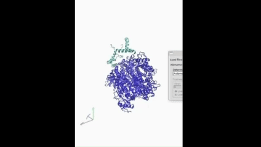

# ⚛️ SAMHD1–SOX11 Molecular Dynamics (MD) Simulation Analysis

This repository hosts a complete MD simulation workflow and post-analysis of the SAMHD1–SOX11 complex following HADDOCK docking. Two binding modes (Cluster 200: random, Cluster 361: centroid-restrained) were simulated to evaluate structural stability, flexibility, and inter-chain interactions.

---

## 🧪 Goals

- Simulate the dynamics of the SAMHD1–SOX11 complex in GROMACS
- Evaluate stability via RMSD, RMSF, RoG, and SASA
- Quantify protein–protein interaction interface and hydrogen bonds
- Visualize structural dynamics and binding behavior per docking cluster

---

## 🗂️ Repository Structure

```
SAMHD1-SOX11-MD-Simulation/
├── data/                       # Raw GROMACS inputs (topol.top, mdp, gro, ndx)
├── random/
│   ├── topol.top
│   ├── step3_input.gro
│   ├── step4.0_minimization.{gro,mdp,tpr}
│   ├── step4.1_equilibration.{gro,mdp,tpr}
│   ├── step4.2_equilibration.{gro,mdp,tpr}
│   └── step5_production.{gro,mdp,tpr}
│
└── centroid/
    ├── topol.top
    ├── step3_input.gro
    ├── step4.0_minimization.{gro,mdp,tpr}
    ├── step4.1_equilibration.{gro,mdp,tpr}
    ├── step4.2_equilibration.{gro,mdp,tpr}
    └── step5_production.{gro,mdp,tpr}
├── results/                    # Post-simulation plots and tables
├── figures/                    # VMD-rendered molecular frames
├── scripts/                    # TCL, bash, and Python analysis scripts
│   ├── run_gromacs_48.sh
│   ├── analyze_samhd1_sox11_vmd_revised_hbonds_v3.tcl
│   ├── unified_md_analysis_protien.tcl
│   ├── unified_md_analysis_protien_chains.tcl
│   └── pp_docking_vis.py
├── README.md
├── LICENSE
└── .gitignore
```

---

## 🔁 Workflow Overview

1. **Preparation & Docking**
   - Input models from HADDOCK cluster 200 and 361
   - Cleaned and aligned for GROMACS compatibility

2. **MD Simulation (GROMACS)**
   - Run on SLURM using GPU node
   - Continuation support (`-cpi`) for checkpoint recovery

```bash
bash scripts/run_gromacs_48.sh
```

3. **Analysis**
   - TCL/VMD scripts for structural metrics: RMSD, RMSF, RoG, SASA, H-bonds
   - Python visualization via `pp_docking_vis.py`

---

## 📈 Key Output Visualizations

### 📊 Cluster 200 (Random Docking)

| Snapshot | Analysis |
|----------|----------|
|  |  |

### 📊 Cluster 361 (Centroid Docking)

| Snapshot | Analysis |
|----------|----------|
|  |  |

---

## 🧬 Metrics Captured

- **Root Mean Square Deviation (RMSD)**
- **Radius of Gyration (RoG)**
- **Solvent Accessible Surface Area (SASA)**
- **Hydrogen Bond Count**
- **Interface SASA** (Inter-chain only)
- **Chain-specific RMSF**

---

## 📌 Reproduce Locally

1. Clone the repository
```bash
git clone https://github.com/YOUR_USERNAME/SAMHD1-SOX11-MD-Simulation.git
cd SAMHD1-SOX11-MD-Simulation
```

2. Prepare your GROMACS environment (e.g., GROMACS 2023.4 with GPU)

3. Modify and run `scripts/run_gromacs_48.sh` for your local SLURM config

4. Analyze with:
```bash
vmd -dispdev text -e scripts/unified_md_analysis_protien.tcl
python3 scripts/pp_docking_vis.py
```

---

## 👨‍💻 Author

**Fares Ibrahim**  
Bioinformatics | Structural Biology | MD Simulation  
🔗 [LinkedIn](https://www.linkedin.com) | 🌐 [GitHub](https://github.com/Fares77-a11y)

---
